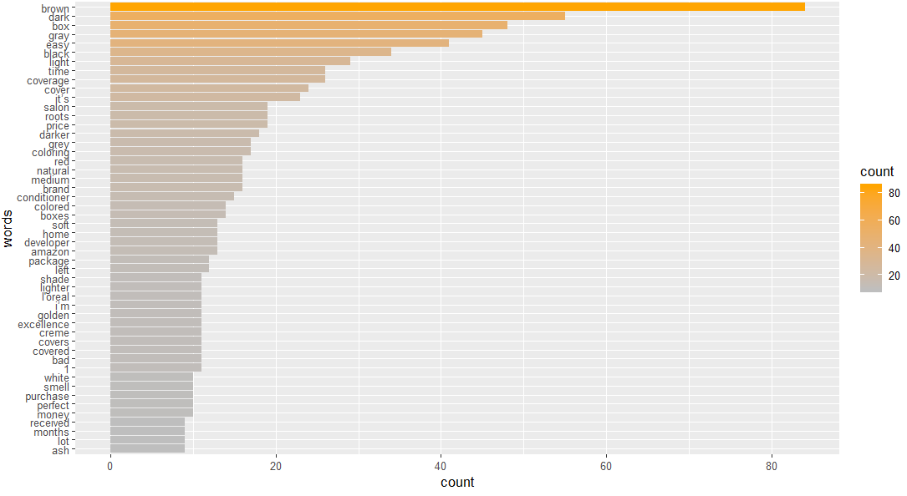

# Online haircoloring products trend analysis

dashboard link:  https://huizhezhu.shinyapps.io/amazon-review/

The beauty Industry was impacted due to COVID19 with the closures of hair salons. This change created demand for DIY beauty products. For instance, in the DIY hair coloring category, sales increased 115% when compared to the months before the start of the quarantine. Before COVID, the global market for hair coloring was expected to increase to 40 billion U.S. dollars by 2023. Now the areas of the U.S are starting to re-open; our goal is to determine if the time in quarantine and the risk for COVID have changed the purchasing patterns of consumers. The goal of this assessment is to determine if there is more demand for DIY hair coloring products post-lockdown and to deliver actionable data insights that will guide our client’s investment strategy in the hair coloring segment. 

https://cran.r-project.org/web/packages/tidytext/vignettes/tidytext.html

